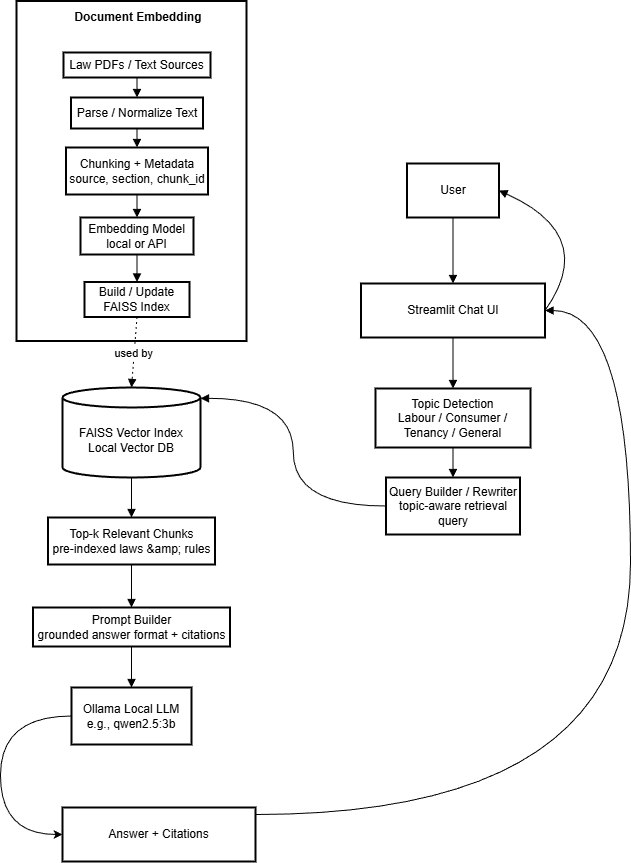
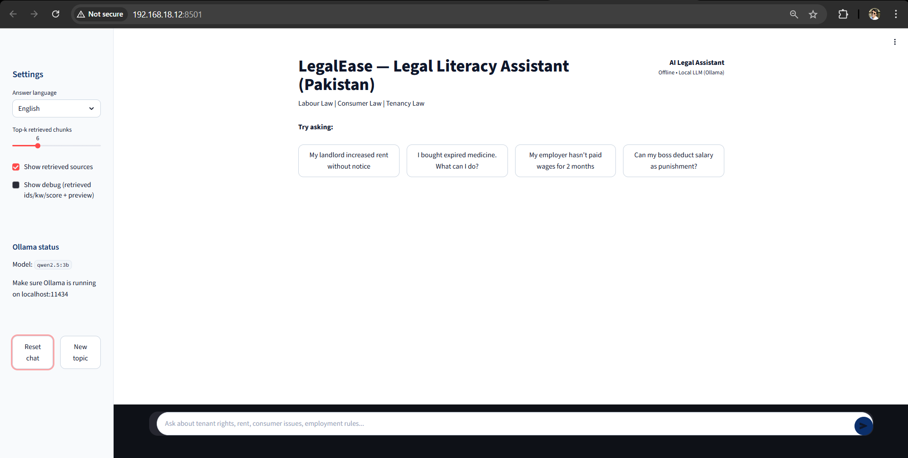
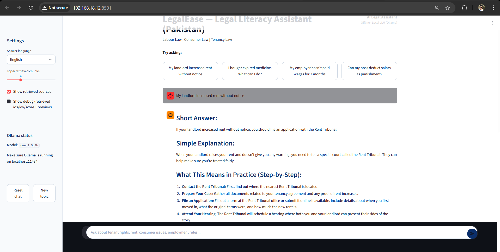
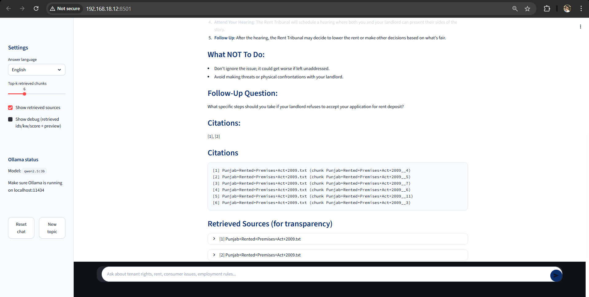
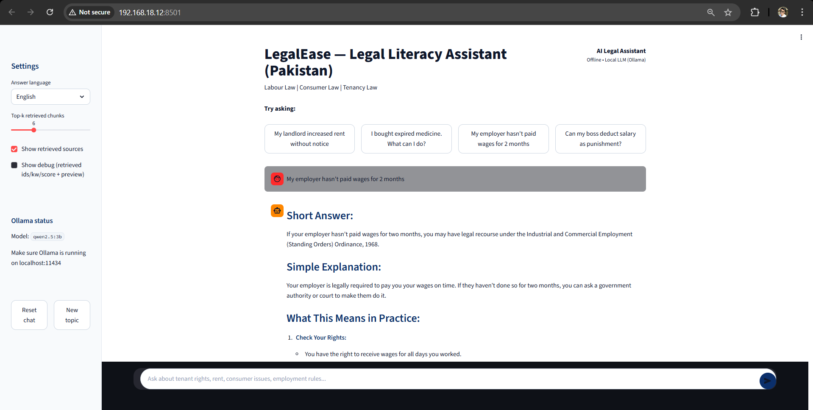
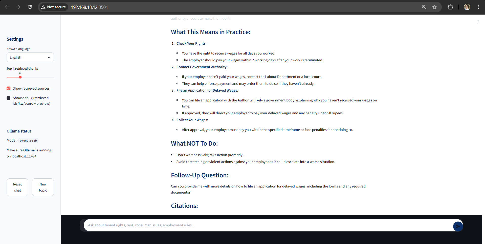
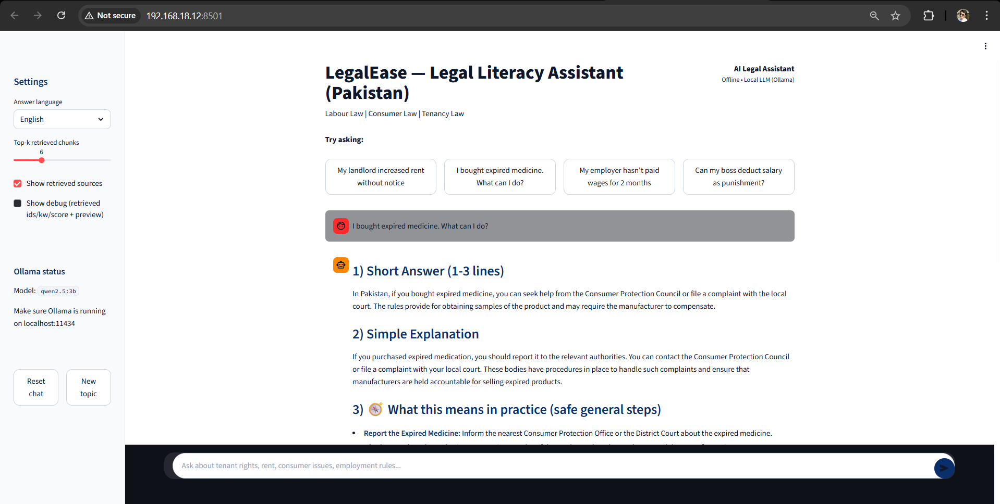
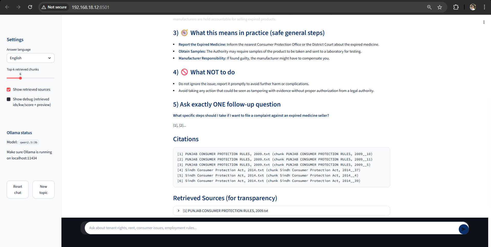
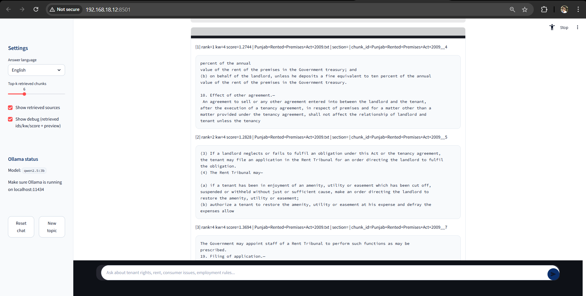
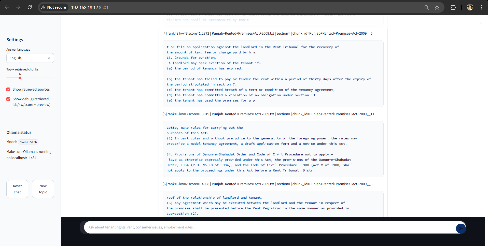

# LegalEase – AI-Powered Legal Literacy Assistant for Pakistan

LegalEase is an AI-powered legal literacy system that helps people in Pakistan understand everyday legal problems — such as tenant disputes, unpaid wages, consumer complaints, and employment issues — using grounded answers from real laws instead of hallucinations.

This project combines Retrieval-Augmented Generation (RAG) with semantic search, legal text indexing, and a local LLM to provide plain-language legal guidance with citations.

## 🎯 What Problem Does This Solve?

**In Pakistan, most people:**

- Don’t know which law applies to their problem
- Can’t read legal documents
- Can’t afford lawyers
- Get wrong advice from hearsay

**LegalEase aims ro resolve this by:**

- Taking real Pakistani laws
- Breaking them into searchable chunks
- Letting an AI explain them in simple English or Urdu
- Always showing which law the answer came from

This prevents hallucination and builds trust.

## 🧠 How LegalEase Works?

LegalEase is a retrieval-augmented legal assistant that uses local embeddings and a local LLM to provide grounded answers from Pakistani law.

## System

### What this diagram shows
- How law PDFs are converted into a searchable vector database  
- How user queries are routed, rewritten, retrieved, and answered  
- How citations are produced from real law text

**1. Legal Text Ingestion**

Official Pakistani legal documents are stored in data/text/. These include:

- Punjab Rented Premises Act, 2009
- Sindh Consumer Protection Act, 2014
- West Pakistan Shops & Establishments Ordinance
- Industrial & Commercial Employment (Standing Orders) Ordinance
- Islamabad Consumer Protection Act

**2. Intelligent Chunking**

Each law is:

- Split into paragraphs
- Section headers detected (e.g., Section 13 — Obligations of tenant)
- Grouped into overlapping chunks
- Stored with metadata:

    {
    "source": "Punjab-Rented-Premises-Act-2009.txt",
    "section": "Section 13 — Obligations of tenant",
    "text": "...",
    "chunk_id": "Punjab-Rented-Premises-Act__14"
    }

**3. Vector Index (FAISS)**

- Each chunk is converted into an embedding using sentence-transformers/all-MiniLM-L6-v2. The vectors are stored in a FAISS index, enabling semantic search. This allows the system to understand:

“My landlord raised rent without notice”
and retrieve the relevant legal section even if the words don’t match exactly.

**4. Topic-Aware Retrieval**

LegalEase detects whether a question is about Tenancy, Consumer law, Employment, or something else. This prevents mixing unrelated laws in follow-up questions. Example: 

*Tenant question → consumer question*
The system resets retrieval so the wrong law is not used.

**5. Context Confidence Scoring**

Each retrieval is scored based on Keyword overlap and Vector similarity. Then the system decides whether the retrieved law is High confidence, Medium, or Low. 

If confidence is low the AI switches to safe mode:

- No claiming exact sections
- Cautious wording
- Asks one clarifying question
- Still cites sources

This prevents false legal claims.

**6. Grounded Prompting**

The AI is forced to only answer using retrieved law text and use a strict output format to give:

- Short answer
- Simple explanation
- Practical steps
- What not to do
- One follow-up question
- Citations

The system forces the model to extract the closest legal principle and explain it safely. Otherwise in case of anything beyond its capacity, the model will announce “Not explicitly stated in the sources…” or it extracts the closest legal rule and explains it safely.

**7. Local LLM (Ollama)**

The assistant runs locally using **qwen2.5:3b** via Ollama, so this model has:

- No API cost
- No data leaves the machine
- Fully offline capable

## 🖥️ User Interface

Built with Streamlit, providing:

- Chat interface
- Topic reset
- Debug mode (view chunks, scores)
- Citation display
- Full retrieved source transparency

**Example Questions**

LegalEase can handle questions like:

“My landlord increased rent without notice.”
“My employer hasn’t paid me for 2 months.”
“Can my boss deduct salary for bad attitude?”
“I bought expired medicine from a pharmacy.”
“Which law applies if I work remotely for a foreign company?”

Each answer:

- Comes from Pakistani law
- Shows the legal source
- Explains it in simple language

## 🚀 How to Run

1. Install dependencies
pip install -r requirements.txt

2. Build the index
python src/build_index.py

3. Start Ollama
ollama run qwen2.5:3b

4. Launch the app
streamlit run src/app.py

## 🏁 Why This Project Matters?

This is not a chatbot. It is a sophisticated legal Retrieval-Augmented Generation (RAG) system designed with appropriate safeguards for real-world application. 

The architecture incorporates topic awareness to understand the specific legal domain and context of each query, making sure that the responses remain relevant and appropriately scoped. 

It features hallucination control mechanisms that prevent the system from generating fabricated legal information or citing non-existent precedents, a critical requirement when dealing with matters of law. 

Citation enforcement ensures that every legal claim or interpretation is properly attributed to authoritative sources, maintaining the transparency and verifiability essential to legal work. 

The system also employs confidence-based safety measures, allowing it to recognize the limits of its knowledge and defer to human experts when uncertainty exists, rather than providing potentially harmful misinformation. All of this is grounded in real-world law, drawing from actual statutes, case law, and legal principles rather than hypothetical or generalized information.

The architectural principles underlying this legal RAG system are scalable and transferable to other domains such as Healthcare to provide evidence-based medical information, Financial services when dealing with complex regulatory requirements, Government agencies could apply this framework to ensure accurate policy information and regulatory compliance.

Essentially, any regulated domain where accuracy, traceability, and safety are paramount can benefit from this architecture approach.

## 📸 System Screenshots

### Home Interface

### Tenant Rights (Punjab Rent Law)

### Employment Law (Unpaid Wages)

### Consumer Protection

### Debug

